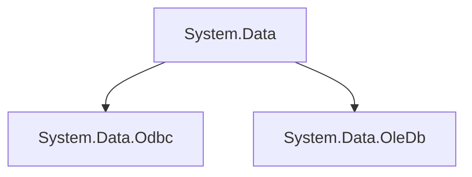
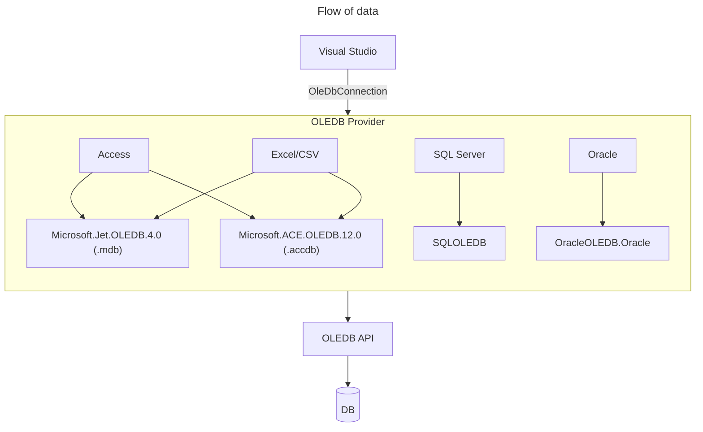
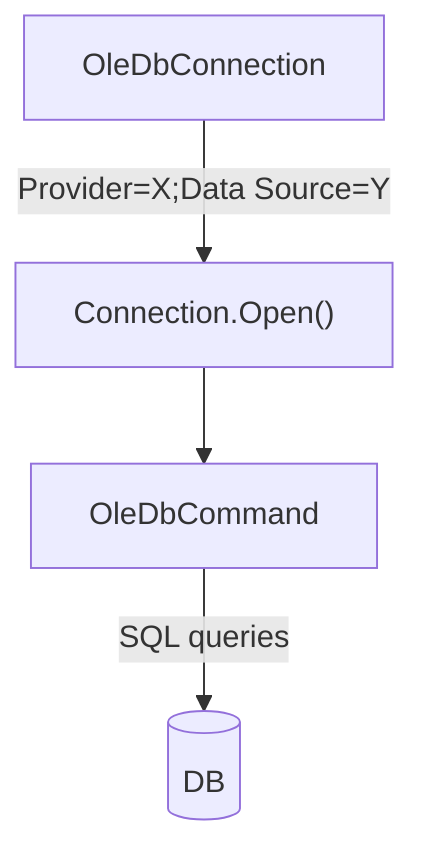
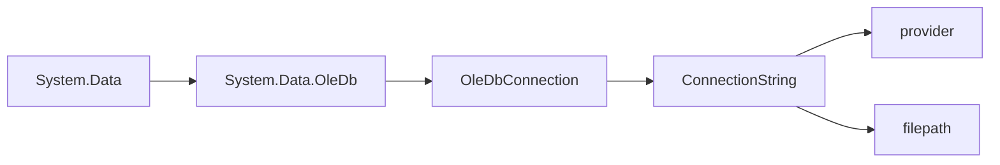
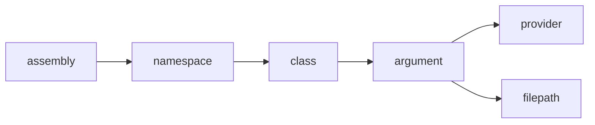

# Extract, Transform, Load (ETL)

## Intro

In data handling, `ETL` is a common approach:

1. We tap into an existing database.
1. Retrieve specific information.
1. Format that information if needed.
1. Then store it elsewhere.


This recalls the basic concept of computing (see [computer science](https://github.com/sximenez/2023-12-dec-computer-science)):


In this exercise, we'll implement the following model to manipulate a simple `.xls` file via a C# program.

Our objective is to be able to:
1. Read the file.
1. Retrieve its contents.
1. Format some lines.
1. Then output a new file.


## The 'DB'

Our test database (the `.xls` file) contains the following entries:

|	ID	|	Name	|	Age	|	Occupation	|	Salary
|	---	|	---	|	---	|	---	|	---
|	1	|	John Doe	|	25	|	Software Engineer	|	70000
|	2	|	Jane Smith	|	30	|	Data Scientist	|	80000
|	3	|	Jim Brown	|	35	|	Product Manager	|	90000
|	4	|	Jill White	|	40	|	UX Designer	|	75000
|	5	|	Joe Green	|	45	|	QA Engineer	|	65000
|	6	|	Jenny Black	|	50	|	CTO	|	120000
|	7	|	Jeff Grey	|	55	|	CFO	|	130000
|	8	|	Jessica Yellow	|	60	|	COO	|	110000
|	9	|	Jeremy Red	|	65	|	CEO	|	140000
|	10	|	Jasmine Blue	|	70	|	Retired	|	50000


## 1. Connector: read the file

We start by defining a connector connecting to the database.

### Providers

For this purpose, C# provides the assembly `System.Data`.

Within this assembly, multiple namespaces (class groups) providing pre-defined classes are available.

The main ones are `System.Data.Odbc` and `System.Data.OleDb`.

They can be used to connect to `Access`, `Excel`, `SQL` or `Oracle` files, among others.

`Odbc` is more generic and older than `OleDb`, which is more Microsoft-oriented.



#### ODBC

Let's begin by testing an `Odbc` connection (`Open Database Connectivity`).

In a Windows environment, an ODBC manager is pre-installed (Start -> ODBC).

The ODBC manager uses drivers, or translators between our program and the queried database.

```ps
# Check available local drivers via PowerShell.
Get-OdbcDriver -Name *excel*

# Output.
Name      : Microsoft Excel Driver (*.xls)
Platform  : 32-bit
Attribute : {[FileExtns, *.xls], [FileUsage, 1], [DriverODBCVer, 02.50], [CPTimeout, <non regroupé>]…}
```

If the file being queried is old (before 2007), a 32-bit (x86) driver is often needed.

Since we will be using an `.xls` file (97-2003), this driver will do.

For other extensions, a driver can be downloaded online.

We can now create a `data source` using this driver to interface with our `.xls` file:

```ps
# Set up a new Data Source pointing to the file.
PS C:\> Add-OdbcDsn 
-Name ExcelETL
-Platform 32-bit
-SetPropertyValue 'Dbq=path_to_file'
-DriverName: 'Microsoft Excel Driver (*.xls)'
-DsnType User

# Output.
PS C:\> get-odbcdsn -name *excel*

Name       : ExcelETL
DsnType    : User
Platform   : 32-bit
DriverName : Microsoft Excel Driver (*.xls)
Attribute  : {[DBQ, path_to_file], [FirstRowHasNames, 01], [SafeTransactions, 0], [Threads, 3]…}
```

### Coding the connector

To establish a connection, both `Odbc` and `OleDb` need a `ConnectionString`:

```c#
// Program.

public class Connector
{
    // Properties.
    public string ConnectionString { get; set; }
    public OdbcConnection Connection { get; set; }

    // Constructor.
    public Connector()
    {
        ConnectionString = string.Empty;
        Connection = new OdbcConnection();
    }
```

While coding our connector, let's define the behavior we want to see:

1. The connector should check if the file to be queried exists.
1. If the file exists, the connector should populate the `ConnectionString` accordingly.
1. If the `ConnectionString` is populated, the connector should open a `Connection` successfully.
1. Otherwise, the connector should not proceed.

```c#
// Unit test.
// Mocked values for testing.

private string mockedDatabasePath = string.Empty;

[TestInitialize()]
public void Init()
{
    mockedDatabasePath = @"path_to_file";
}
```

```c#
// Unit test.
// 1. The connector should check if the file to be queried exists.

public static bool DoesFileExist(string path)
{
    return File.Exists(path);
}

[TestMethod()]
public void Check_If_File_Exists()
{
    Assert.IsTrue(DoesFileExist(mockedDatabasePath));
}
```

```c#
// Unit test.
// 2. If the file exists, the connector should populate the ConnectionString accordingly.

[TestMethod()]
public void Connector_Should_Populate_Connection_String_When_File_Exists()
{

    if (DoesFileExist(mockedDatabasePath))
    {
        string expectedConnectionString = $@"Driver=Microsoft Excel Driver (*.xls);DBQ=path_to_file;";

        Connector connector = new Connector();
        connector.SetConnectionString(mockedDatabasePath);
        Assert.AreEqual(expectedConnectionString, connector.ConnectionString);
    }
    else
    {
        Assert.Fail("File doesn't exist.");
    }
}
```

We can unit test the program by breaking it up into small testable methods:

```c#
// Program.

public void SetConnectionString(string databasePath)
{
    ConnectionString = $@"Driver=Microsoft Excel Driver (*.xls);DBQ={databasePath};";
}
```

```c#
// Unit test.
// 3. If the ConnectionString is populated, the connector should open a Connection successfully.

[TestMethod()]
public void Connector_Should_Establish_Connection_When_String_Populated()
{

    if (DoesFileExist(mockedDatabasePath))
    {
        Connector connector = new Connector();
        connector.SetConnectionString(mockedDatabasePath);
        connector.SetConnection();

        using (connector.Connection)
        {
            connector.OpenConnection();
            Assert.IsTrue(connector.Connection.State == ConnectionState.Open);
        }
        Assert.IsTrue(connector.Connection.State == ConnectionState.Closed);
    }
    else
    {
        Assert.Fail("File doesn't exist.");
    }
}

```

```c#
// Program.

public void SetConnection()
{
    Connection = new OdbcConnection(ConnectionString);
}

public void OpenConnection()
{
    try
    {
        Connection.Open();

        // Really test the connection by querying the file.
        OdbcCommand command = new("SELECT * FROM [Sheet1$]", Connection);
        OdbcDataReader reader = command.ExecuteReader();
    }

    catch (OdbcException ex)
    {
        Console.WriteLine($"Error occured here: {ex.Message}");
    }
}
```

If our `.xls` file exists at the file path provided, our connector should pass all the tests and connect to the file successfully.

## 2. Retriever: get the data

Now that we can connect to the file, let's get the data.

### Coding the retriever

In terms of behavior, we want the retriever to:

1. Check if a query exists.
2. If the query exists, the retriever should execute it accordingly.
3. If the execution goes well, the retriever should store the data in the `Data` property.
4. Otherwise, the retriever should not proceed.

```c#
// Unit test.
// Mocked values for testing.

private string mockedDatabasePath = string.Empty;
private string mockedQuery = string.Empty;

[TestInitialize()]
public void Init()
{
    mockedDatabasePath = @"path_to_file";
    mockedQuery = "SELECT * FROM [Sheet1$]";
}
```

```c#
// Unit test.
// 1. Check if the query exists.

public static bool DoesQueryExist(string query)
{
    return query != string.Empty;
}

[TestMethod()]
public void Check_If_Query_Exists()
{
    Assert.IsTrue(DoesQueryExist(mockedQuery));
}
```

```c#
// Unit test.
// 2. If the query exists, the retriever should execute it accordingly.

[TestMethod()]
public void Retriever_Should_Execute_Command_When_Query_Exists()
{

    if (DoesFileExist(mockedDatabasePath) && DoesQueryExist(mockedQuery))
    {
        Connector connector = new Connector();
        connector.SetConnectionString(mockedDatabasePath);
        connector.SetConnection();

        Retriever retriever = new Retriever();

        using (connector.Connection)
        {
            connector.OpenConnection();
            retriever.GetData(connector.Connection, mockedQuery);
        }
    }
    else
    {
        Assert.Fail("File doesn't exist.");
    }
}
```

```c#
// Program.

public class Retriever
{
    // Properties.
    public List<string> Headers { get; set; }
    public List<string> Data { get; set; }
    public int NumberOfColumns { get; set; }

    // Constructor.
    public Retriever()
    {
        Headers = new List<string>();
        Data = new List<string>();
    }

    public void GetData(OdbcConnection connection, string query)
    {
        OdbcCommand command = new(query, connection);
        OdbcDataReader reader = command.ExecuteReader();
        NumberOfColumns = reader.FieldCount;

        if (NumberOfColumns > 0)
        {

            for (int i = 0; i < NumberOfColumns; i++)
            {
                string header = reader.GetName(i);
                Headers.Add(header);
            }

            while (reader.Read())
            {
                for (int i = 0; i < reader.FieldCount; i++)
                {
                    Data.Add(reader.GetString(i));
                }
            }
        }
    }
}
```

```console
# Output.

1.0
John Doe
25.0
Software Engineer
70000.0
2.0
Jane Smith
30.0
Data Scientist
80000.0
3.0
Jim Brown
35.0
Product Manager
90000.0
...
```

## 3. Formatter: apply changes

So far so good! We have now successfully extracted the contents of our file.

Let's now apply the following changes to the name of each entry:

```console
# Actual -> John Doe
# Expected -> Nhoj Eod
```

### Coding the formatter

```c#
// Unit test.

[TestMethod()]
public void Formatter_Should_Apply_Changes_When_Input_Exists()
{

    if (DoesFileExist(mockedDatabasePath) && DoesQueryExist(mockedQuery))
    {
        Connector connector = new Connector();
        connector.SetConnectionString(mockedDatabasePath);
        connector.SetConnection();

        Retriever retriever = new Retriever();

        using (connector.Connection)
        {
            connector.OpenConnection();
            retriever.GetData(connector.Connection, mockedQuery);
        }

        Formatter formatter = new Formatter();
        formatter.FormatData(retriever.Data, retriever.NumberOfColumns);
    }
    else
    {
        Assert.Fail("File doesn't exist.");
    }
}
```

```c#
// Program.

public class Formatter
{
    // Properties.
    public List<string> FormattedData { get; set; }

    // Constructor.
    public Formatter()
    {
        FormattedData = new List<string>();
    }

    public void FormatData(List<string> data, int numberOfColumns)
    {
        if (data.Count > 0)
        {
            for (int i = 0; i < data.Count; i++)
            {
                // This allows to target the 'Name' column only (1, 6, 11...).
                if (i % numberOfColumns == 1)
                {
                    var words = data[i].Split(' ')
                        .Select(word => word.ToLower())
                        .Select(word => new string(word.Reverse().ToArray()))
                        .Select(word => char.ToUpper(word[0]) + word[1..]);

                    var result = string.Join(" ", words);
                    FormattedData.Add(result);
                }

                else
                {
                    FormattedData.Add(data[i]);
                }
            }
        }
    }
}
```

```console
# Output.

1.0
Nhoj Eod
25.0
Software Engineer
70000.0
2.0
Enaj Htims
30.0
Data Scientist
80000.0
3.0
Mij Nworb
35.0
Product Manager
90000.0
...
```

## 4. Writer: output the formatted data

Once formatting has been applied, we usually load the data onto another database.

For this exercise, let's output the formatted data into a new `.xls` file.

### Coding the writer

```c#
// Unit test.

[TestMethod()]
public void Writer_Should_Create_New_File_When_Formatted_Data_Exists()
{

    if (DoesFileExist(mockedDatabasePath) && DoesQueryExist(mockedQuery))
    {
        Connector connector = new Connector();
        connector.SetConnectionString(mockedDatabasePath);
        connector.SetConnection();

        Retriever retriever = new Retriever();

        using (connector.Connection)
        {
            connector.OpenConnection();
            retriever.GetData(connector.Connection, mockedQuery);
        }

        Formatter formatter = new Formatter();
        formatter.FormatData(retriever.Data, retriever.NumberOfColumns);

        Writer writer = new Writer();
        writer.WriteFile(mockedOutputPath, retriever.Headers, formatter.FormattedData, retriever.NumberOfColumns);

        Assert.IsTrue(writer.HasWrittenFile);
    }

    else
    {
        Assert.Fail("File doesn't exist.");
    }
}
```

```c#
// Program.

public class Writer
{
    // Properties.
    public bool HasWrittenFile { get; set; }

    // Constructor.
    public Writer()
    {
        HasWrittenFile = false;
    }

    public void WriteFile(string outputPath, List<string> headers, List<string> formattedData, int numberOfColumns)
    {
        // Excel files are zipped XML files, difficult to produce from scratch.
        // I'm using the EPPlus library as a result.
        ExcelPackage.LicenseContext = LicenseContext.NonCommercial;
        FileInfo outputFile = new FileInfo(outputPath);

        // If an output file exists, delete it.
        if (outputFile.Exists)
        {
            outputFile.Delete();
        }

        using (ExcelPackage package = new ExcelPackage(outputFile))
        {
            ExcelWorksheet worksheet = package.Workbook.Worksheets.Add("Sheet1");

            int row;
            int col;
                
            // We inject the headers which are stored on a separate list.
            for (int i = 0; i < headers.Count; i++)
            {
                row = i / numberOfColumns + 1;
                col = i % numberOfColumns + 1;
                worksheet.Cells[row, col].Value = headers[i];
            }

            // We inject the data starting at row 2.
            for (int i = 0; i < formattedData.Count; i++)
            {
                row = i / numberOfColumns + 2;
                col = i % numberOfColumns + 1;
                worksheet.Cells[row, col].Value = formattedData[i];
            }

            package.Save();
            HasWrittenFile = true;
        }
    }
}
```

## Result

We have successfully output a new file with the desired formatting:

|	ID	|	Name	|	Age	|	Occupation	|	Salary	|
|	---	|	---	|	---	|	---	|	---	|
|	1.0	|	Nhoj Eod	|	25.0	|	Software Engineer	|	70000.0	|
|	2.0	|	Enaj Htims	|	30.0	|	Data Scientist	|	80000.0	|
|	3.0	|	Mij Nworb	|	35.0	|	Product Manager	|	90000.0	|
|	4.0	|	Llij Etihw	|	40.0	|	UX Designer	|	75000.0	|
|	5.0	|	Eoj Neerg	|	45.0	|	QA Engineer	|	65000.0	|
|	6.0	|	Ynnej Kcalb	|	50.0	|	CTO	|	120000.0	|
|	7.0	|	Ffej Yerg	|	55.0	|	CFO	|	130000.0	|
|	8.0	|	Acissej Wolley	|	60.0	|	COO	|	110000.0	|
|	9.0	|	Ymerej Der	|	65.0	|	CEO	|	140000.0	|
|	10.0	|	Enimsaj Eulb	|	70.0	|	Retired	|	50000.0	|

This is 

### OleDB in more detail






---

The main class is `OleDbConnection`, which opens a connection using a `connection string` (a provider and a filepath).






Yes, an interface would work well for this scenario. You can define an IConnection interface that declares the methods and properties that both OdbcConnection and OleDbConnection have in common. Then, you can create classes that implement this interface and wrap the OdbcConnection and OleDbConnection classes.

In your Connector class, you would then declare Connection as an IConnection. When you need to set the connection, you can create an instance of the appropriate class based on the connectorType and assign it to Connection.

This way, you can work with Connection as an IConnection in your code, and the actual type of connection (ODBC or OleDb) is abstracted away. This makes your code more flexible and easier to maintain, as you can add more types of connections in the future without having to change the code that uses Connection.