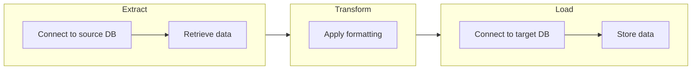
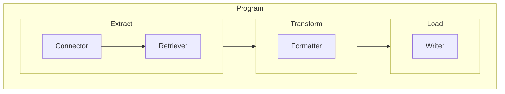
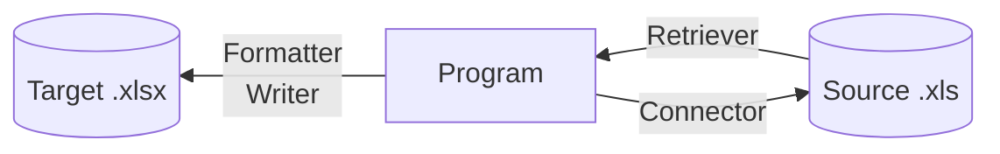
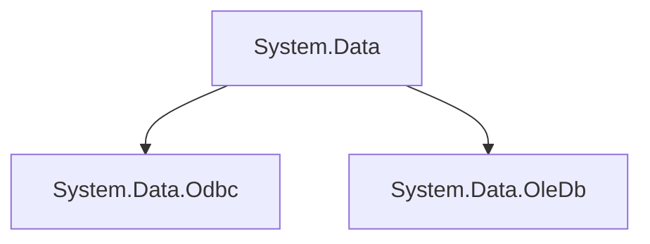
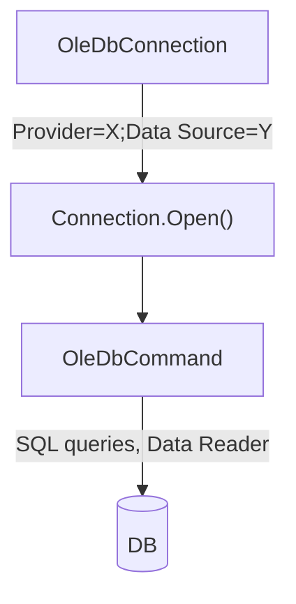
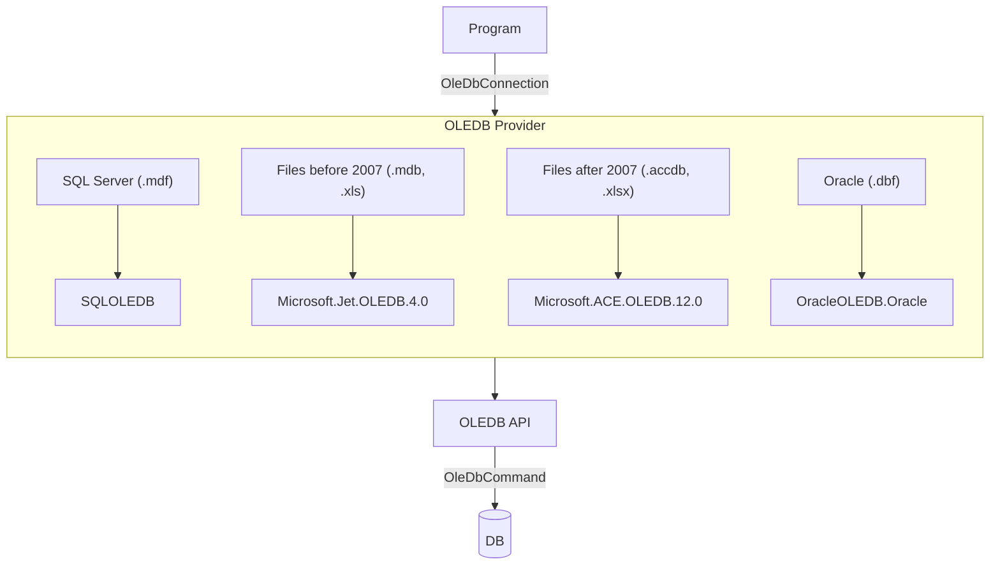

# Extract, Transform, Load (ETL)

<!--TOC-->
  - [Intro](#intro)
  - [The source 'DB'](#the-source-db)
  - [The target 'DB'](#the-target-db)
  - [1. Connector: read the file](#1.-connector-read-the-file)
    - [Providers](#providers)
      - [ODBC](#odbc)
    - [Coding the connector](#coding-the-connector)
  - [2. Retriever: get the data](#2.-retriever-get-the-data)
    - [Coding the retriever](#coding-the-retriever)
  - [3. Formatter: apply changes](#3.-formatter-apply-changes)
    - [Coding the formatter](#coding-the-formatter)
  - [4. Writer: output the formatted data](#4.-writer-output-the-formatted-data)
    - [Coding the writer](#coding-the-writer)
  - [Result](#result)
  - [Refactoring](#refactoring)
    - [Retriever](#retriever)
    - [Unit tests](#unit-tests)
  - [Connector: adding OleDb](#connector-adding-oledb)
    - [OLEDB](#oledb)
      - [Providers](#providers)
  - [Interface: IConnection](#interface-iconnection)
    - [Strategy pattern](#strategy-pattern)
    - [Simpler implementation with switches](#simpler-implementation-with-switches)
  - [5. Extractor: binding everything together](#5.-extractor-binding-everything-together)
  - [Conclusion](#conclusion)
<!--/TOC-->

## Intro

In data handling, `ETL` is a common approach:

1. We tap into an existing database.
1. Retrieve specific information.
1. Format that information if needed.
1. Then store it elsewhere.



This recalls the basic concept of computing (see [computer science](https://github.com/sximenez/2023-12-dec-computer-science)):


In this exercise, we'll implement the following model to manipulate a simple `.xls` file via a C# program.

Our objective is to be able to:
1. Read the file.
1. Retrieve its contents.
1. Format some lines.
1. Then output a new file.





## The source 'DB'

Our test database (the `.xls` file) contains the following entries:

|	ID	|	Name	|	Age	|	Occupation	|	Salary
|	---	|	---	|	---	|	---	|	---
|	1	|	John Doe	|	25	|	Software Engineer	|	70000
|	2	|	Jane Smith	|	30	|	Data Scientist	|	80000
|	3	|	Jim Brown	|	35	|	Product Manager	|	90000
|	4	|	Jill White	|	40	|	UX Designer	|	75000
|	5	|	Joe Green	|	45	|	QA Engineer	|	65000
|	6	|	Jenny Black	|	50	|	CTO	|	120000
|	7	|	Jeff Grey	|	55	|	CFO	|	130000
|	8	|	Jessica Yellow	|	60	|	COO	|	110000
|	9	|	Jeremy Red	|	65	|	CEO	|	140000
|	10	|	Jasmine Blue	|	70	|	Retired	|	50000

## The target 'DB'

We want to be able to output a new `.xls` file with the name of each entry reversed and capitalized:

|	ID	|	Name	|	Age	|	Occupation	|	Salary	|
|	---	|	---	|	---	|	---	|	---	|
|	1	|	Nhoj Eod	|	25	|	Software Engineer	|	70000	|
|	2	|	Enaj Htims	|	30	|	Data Scientist	|	80000	|
|	3	|	Mij Nworb	|	35	|	Product Manager	|	90000	|
|	4	|	Llij Etihw	|	40	|	UX Designer	|	75000	|
|	5	|	Eoj Neerg	|	45	|	QA Engineer	|	65000	|
|	6	|	Ynnej Kcalb	|	50	|	CTO	|	120000	|
|	7	|	Ffej Yerg	|	55	|	CFO	|	130000	|
|	8	|	Acissej Wolley	|	60	|	COO	|	110000	|
|	9	|	Ymerej Der	|	65	|	CEO	|	140000	|
|	10	|	Enimsaj Eulb	|	70	|	Retired	|	50000	|

## 1. Connector: read the file

We start by defining a connector to connect to the database.

### Providers

For this purpose, C# provides the assembly `System.Data`.

Within this assembly, multiple namespaces (class groups) providing pre-defined classes are available.

The main ones are `System.Data.Odbc` and `System.Data.OleDb`.

They can be used to connect to `Access`, `Excel`, `SQL` or `Oracle` files, among others.

`Odbc` is more generic and older than `OleDb`, which is more Microsoft-oriented.



#### ODBC

Let's begin by testing an `Odbc` connection (`Open Database Connectivity`).

In a Windows environment, an ODBC manager is pre-installed (Start -> ODBC).

The ODBC manager uses drivers, or translators between our program and the queried database.

```console
# Check available local drivers via PowerShell.
Get-OdbcDriver -Name *excel*

# Output.
Name      : Microsoft Excel Driver (*.xls)
Platform  : 32-bit
Attribute : {[FileExtns, *.xls], [FileUsage, 1], [DriverODBCVer, 02.50], [CPTimeout, <non regroupé>]…}
```

If the file being queried is old (before 2007), a 32-bit (x86) driver is often needed.

Since we will be using an `.xls` file (97-2003), this driver will do.

For other extensions, a driver can be downloaded online.

We can now create a `Data Source` using this driver to interface with our `.xls` file:

```console
# Set up a new Data Source pointing to the file.
PS C:\> Add-OdbcDsn 
-Name ExcelETL
-Platform 32-bit
-SetPropertyValue 'Dbq=path_to_file'
-DriverName: 'Microsoft Excel Driver (*.xls)'
-DsnType User

# Output.
PS C:\> get-odbcdsn -name *excel*

Name       : ExcelETL
DsnType    : User
Platform   : 32-bit
DriverName : Microsoft Excel Driver (*.xls)
Attribute  : {[DBQ, path_to_file], [FirstRowHasNames, 01], [SafeTransactions, 0], [Threads, 3]…}
```

### Coding the connector

To establish a connection, both `Odbc` and `OleDb` need a `ConnectionString`:

```c#
// Program.

public class Connector
{
    // Properties.
    public string ConnectionString { get; set; }
    public OdbcConnection Connection { get; set; }

    // Constructor.
    public Connector()
    {
        ConnectionString = string.Empty;
        Connection = new OdbcConnection();
    }
```

While coding our connector, let's define the behavior we want to see:

1. The connector should check if the file to be queried exists.
1. If the file exists, the connector should populate the `ConnectionString` accordingly.
1. If the `ConnectionString` is populated, the connector should open a `Connection` successfully.
1. Otherwise, the connector should not proceed.

```c#
// Unit test.
// Mocked values for testing.

private string mockedDatabasePath = string.Empty;

[TestInitialize()]
public void Init()
{
    mockedDatabasePath = @"path_to_file";
}
```

```c#
// Unit test.
// 1. The connector should check if the file to be queried exists.

public static bool DoesFileExist(string path)
{
    return File.Exists(path);
}

[TestMethod()]
public void Check_If_File_Exists()
{
    Assert.IsTrue(DoesFileExist(mockedDatabasePath));
}
```

```c#
// Unit test.
// 2. If the file exists, the connector should populate the ConnectionString accordingly.

[TestMethod()]
public void Connector_Should_Populate_Connection_String_When_File_Exists()
{

    if (DoesFileExist(mockedDatabasePath))
    {
        string expectedConnectionString = $@"Driver=Microsoft Excel Driver (*.xls);DBQ=path_to_file;";

        Connector connector = new Connector();
        connector.SetConnectionString(mockedDatabasePath);
        Assert.AreEqual(expectedConnectionString, connector.ConnectionString);
    }
    else
    {
        Assert.Fail("File doesn't exist.");
    }
}
```

We can unit test the program by breaking it up into small testable methods:

```c#
// Program.

public void SetConnectionString(string databasePath)
{
    ConnectionString = $@"Driver=Microsoft Excel Driver (*.xls);DBQ={databasePath};";
}
```

```c#
// Unit test.
// 3. If the ConnectionString is populated, the connector should open a Connection successfully.

[TestMethod()]
public void Connector_Should_Establish_Connection_When_String_Populated()
{

    if (DoesFileExist(mockedDatabasePath))
    {
        Connector connector = new Connector();
        connector.SetConnectionString(mockedDatabasePath);
        connector.SetConnection();

        using (connector.Connection)
        {
            connector.OpenConnection();
            Assert.IsTrue(connector.Connection.State == ConnectionState.Open);
        }
        Assert.IsTrue(connector.Connection.State == ConnectionState.Closed);
    }
    else
    {
        Assert.Fail("File doesn't exist.");
    }
}

```

```c#
// Program.

public void SetConnection()
{
    Connection = new OdbcConnection(ConnectionString);
}

public void OpenConnection()
{
    try
    {
        Connection.Open();

        // Really test the connection by querying the file (SQL).
        OdbcCommand command = new("SELECT * FROM [Sheet1$]", Connection);
        OdbcDataReader reader = command.ExecuteReader();
    }

    catch (OdbcException ex)
    {
        Console.WriteLine($"Error occured here: {ex.Message}");
    }
}
```

If our `.xls` file exists at the file path provided, our connector should pass all the tests and connect to the file successfully.

## 2. Retriever: get the data

Now that we can connect to the file, let's get the data.

### Coding the retriever

In terms of behavior, we want the retriever to:

1. Check if a query exists.
2. If the query exists, the retriever should execute it accordingly.
3. If the execution goes well, the retriever should store the data in the `Data` property.
4. Otherwise, the retriever should not proceed.

```c#
// Unit test.
// Mocked values for testing.

private string mockedDatabasePath = string.Empty;
private string mockedQuery = string.Empty;

[TestInitialize()]
public void Init()
{
    mockedDatabasePath = @"path_to_file";
    mockedQuery = "SELECT * FROM [Sheet1$]";
}
```

```c#
// Unit test.
// 1. Check if the query exists.

public static bool DoesQueryExist(string query)
{
    return query != string.Empty;
}

[TestMethod()]
public void Check_If_Query_Exists()
{
    Assert.IsTrue(DoesQueryExist(mockedQuery));
}
```

```c#
// Unit test.
// 2. If the query exists, the retriever should execute it accordingly.

[TestMethod()]
public void Retriever_Should_Execute_Command_When_Query_Exists()
{
    if (DoesFileExist(mockedDatabasePath) && DoesQueryExist(mockedQuery))
    {
        Connector connector = new Connector();
        connector.SetConnectionString(mockedDatabasePath);
        connector.SetConnection();

        Retriever retriever = new Retriever();

        using (connector.Connection)
        {
            connector.OpenConnection();
            retriever.GetData(connector.Connection, mockedQuery);
        }
    }
    else
    {
        Assert.Fail("File doesn't exist.");
    }
}
```

```c#
// Program.

public class Retriever
{
    // Properties.
    public List<string> Headers { get; set; }
    public List<string> Data { get; set; }
    public int NumberOfColumns { get; set; }

    // Constructor.
    public Retriever()
    {
        Headers = new List<string>();
        Data = new List<string>();
        NumberOfColumns = 0;
    }

    public void GetData(OdbcConnection connection, string query)
    {
        OdbcCommand command = new(query, connection);
        OdbcDataReader reader = command.ExecuteReader();
        NumberOfColumns = reader.FieldCount;

        if (NumberOfColumns > 0)
        {
            for (int i = 0; i < NumberOfColumns; i++)
            {
                string header = reader.GetName(i);
                Headers.Add(header);
            }

            while (reader.Read())
            {
                for (int i = 0; i < NumberOfColumns; i++)
                {
                    Data.Add(reader.GetString(i));
                }
            }
        }
    }
}
```

```console
# Output.

ID
Name
Age
Occupation
Salary
1.0
John Doe
25.0
Software Engineer
70000.0
2.0
Jane Smith
30.0
Data Scientist
80000.0
3.0
Jim Brown
35.0
Product Manager
90000.0
...
```

## 3. Formatter: apply changes

So far so good! We have now successfully extracted the contents of our file.

Let's now apply the following changes to the name of each entry:

```console
# Actual -> John Doe
# Expected -> Nhoj Eod
```

### Coding the formatter

```c#
// Unit test.

[TestMethod()]
public void Formatter_Should_Apply_Changes_When_Input_Exists()
{
    if (DoesFileExist(mockedDatabasePath) && DoesQueryExist(mockedQuery))
    {
        Connector connector = new Connector();
        connector.SetConnectionString(mockedDatabasePath);
        connector.SetConnection();

        Retriever retriever = new Retriever();

        using (connector.Connection)
        {
            connector.OpenConnection();
            retriever.GetData(connector.Connection, mockedQuery);
        }

        Formatter formatter = new Formatter();
        formatter.FormatData(retriever.Data, retriever.NumberOfColumns);
    }
    else
    {
        Assert.Fail("File doesn't exist.");
    }
}
```

```c#
// Program.

public class Formatter
{
    // Properties.
    public List<string> FormattedData { get; set; }

    // Constructor.
    public Formatter()
    {
        FormattedData = new List<string>();
    }

    public void FormatData(List<string> data, int numberOfColumns)
    {
        if (data.Count > 0)
        {
            for (int i = 0; i < data.Count; i++)
            {
                // This allows to target the 'Name' column only (1, 6, 11...).
                if (i % numberOfColumns == 1)
                {
                    var words = data[i].Split(' ')
                        .Select(word => word.ToLower())
                        .Select(word => new string(word.Reverse().ToArray()))
                        .Select(word => char.ToUpper(word[0]) + word[1..]);

                    var result = string.Join(" ", words);
                    FormattedData.Add(result);
                }

                else
                {
                    FormattedData.Add(data[i]);
                }
            }
        }
    }
}
```

```console
# Output.

1.0
Nhoj Eod
25.0
Software Engineer
70000.0
2.0
Enaj Htims
30.0
Data Scientist
80000.0
3.0
Mij Nworb
35.0
Product Manager
90000.0
...
```

## 4. Writer: output the formatted data

Once formatting has been applied, we usually load the data onto another database.

For this exercise, let's output the formatted data into a new `.xls` file.

### Coding the writer

```c#
// Unit test.

[TestMethod()]
public void Writer_Should_Create_New_File_When_Formatted_Data_Exists()
{
    if (DoesFileExist(mockedDatabasePath) && DoesQueryExist(mockedQuery))
    {
        Connector connector = new Connector();
        connector.SetConnectionString(mockedDatabasePath);
        connector.SetConnection();

        Retriever retriever = new Retriever();

        using (connector.Connection)
        {
            connector.OpenConnection();
            retriever.GetData(connector.Connection, mockedQuery);
        }

        Formatter formatter = new Formatter();
        formatter.FormatData(retriever.Data, retriever.NumberOfColumns);

        Writer writer = new Writer();
        writer.WriteFile(mockedOutputPath, retriever.Headers, formatter.FormattedData, retriever.NumberOfColumns);

        Assert.IsTrue(writer.HasWrittenFile);
    }

    else
    {
        Assert.Fail("File doesn't exist.");
    }
}
```

```c#
// Program.

public class Writer
{
    // Properties.
    public bool HasWrittenFile { get; set; }

    // Constructor.
    public Writer()
    {
        HasWrittenFile = false;
    }

    public void WriteFile(string outputPath, List<string> headers, List<string> formattedData, int numberOfColumns)
    {
        // Excel files are zipped XML files, difficult to produce from scratch.
        // I'm using the EPPlus library as a result.
        ExcelPackage.LicenseContext = LicenseContext.NonCommercial;
        FileInfo outputFile = new FileInfo(outputPath);

        // If an output file exists, delete it.
        if (outputFile.Exists)
        {
            outputFile.Delete();
        }

        using (ExcelPackage package = new ExcelPackage(outputFile))
        {
            ExcelWorksheet worksheet = package.Workbook.Worksheets.Add("Sheet1");

            int row;
            int col;
                
            // We inject the headers which are stored on a separate list.
            for (int i = 0; i < headers.Count; i++)
            {
                row = i / numberOfColumns + 1;
                col = i % numberOfColumns + 1;
                worksheet.Cells[row, col].Value = headers[i];
            }

            // We inject the data starting at row 2.
            for (int i = 0; i < formattedData.Count; i++)
            {
                row = i / numberOfColumns + 2;
                col = i % numberOfColumns + 1;
                worksheet.Cells[row, col].Value = formattedData[i];
            }

            package.Save();
            HasWrittenFile = true;
        }
    }
}
```

## Result

We have successfully output a new file with the desired formatting:

|	ID	|	Name	|	Age	|	Occupation	|	Salary	|
|	---	|	---	|	---	|	---	|	---	|
|	1.0	|	Nhoj Eod	|	25.0	|	Software Engineer	|	70000.0	|
|	2.0	|	Enaj Htims	|	30.0	|	Data Scientist	|	80000.0	|
|	3.0	|	Mij Nworb	|	35.0	|	Product Manager	|	90000.0	|
|	4.0	|	Llij Etihw	|	40.0	|	UX Designer	|	75000.0	|
|	5.0	|	Eoj Neerg	|	45.0	|	QA Engineer	|	65000.0	|
|	6.0	|	Ynnej Kcalb	|	50.0	|	CTO	|	120000.0	|
|	7.0	|	Ffej Yerg	|	55.0	|	CFO	|	130000.0	|
|	8.0	|	Acissej Wolley	|	60.0	|	COO	|	110000.0	|
|	9.0	|	Ymerej Der	|	65.0	|	CEO	|	140000.0	|
|	10.0	|	Enimsaj Eulb	|	70.0	|	Retired	|	50000.0	|

However, integers are being output as strings, which is not accurate.

We can try to refactor our code.

## Refactoring

### Retriever

In our retriever, we can recover data according to its type:

```c#
// Before.
while (reader.Read())
{
    for (int i = 0; i < NumberOfColumns; i++)
    {
        Data.Add(reader.GetString(i));
    }
}

//After.
while (reader.Read())
{
    for (int i = 0; i < NumberOfColumns; i++)
    {
        var data = reader.GetValue(i);
        if (data.GetType() == typeof(string))
        {
            Data.Add(reader.GetString(i));
        } else
        {
            Data.Add(reader.GetDouble(i));
        }
    }
}
```

We now obtain the desired output:

|	ID	|	Name	|	Age	|	Occupation	|	Salary	|
|	---	|	---	|	---	|	---	|	---	|
|	1	|	Nhoj Eod	|	25	|	Software Engineer	|	70000	|
|	2	|	Enaj Htims	|	30	|	Data Scientist	|	80000	|
|	3	|	Mij Nworb	|	35	|	Product Manager	|	90000	|
|	4	|	Llij Etihw	|	40	|	UX Designer	|	75000	|
|	5	|	Eoj Neerg	|	45	|	QA Engineer	|	65000	|
|	6	|	Ynnej Kcalb	|	50	|	CTO	|	120000	|
|	7	|	Ffej Yerg	|	55	|	CFO	|	130000	|
|	8	|	Acissej Wolley	|	60	|	COO	|	110000	|
|	9	|	Ymerej Der	|	65	|	CEO	|	140000	|
|	10	|	Enimsaj Eulb	|	70	|	Retired	|	50000	|

### Unit tests

We can refactor our unit tests as well to avoid DRY (don't repeat yourself):

```c#
private string mockedDatabasePath = string.Empty;
private string mockedQuery = string.Empty;
private string mockedOutputPath = string.Empty;

private Connector connector;
private Retriever retriever;
private Formatter formatter;
private Writer writer;

[TestInitialize()]
public void Init()
{
    mockedDatabasePath = @"C:\Users\steven.jimenez\source\repos\2024-01-jan-etl-extract-transform-load\Input.xls";
    mockedQuery = "SELECT * FROM [Sheet1$]";
    mockedOutputPath = @"C:\Users\steven.jimenez\source\repos\2024-01-jan-etl-extract-transform-load\Output.xlsx";

    connector = new Connector();
    connector.SetConnectionString(mockedDatabasePath);
    connector.SetConnection();

    retriever = new Retriever();
    formatter = new Formatter();
    writer = new Writer();
}
```

## Connector: adding OleDb

Now that our `Odbc` connection is established, let's attempt to add an `Oledb` connection (`Object linking and embedding database`).

### OLEDB

Compared to `Odbc`, `Oledb` is a more recent and flexible C# namespace.

It eliminates the need to declare a `Data Source`.

You declare a provider directly in the `ConnectionString`, which encapsulates the functionality to interface with the database:

```console
Provider=X;Data Source=Y;
```

The syntax of the main classes are the same as `Odbc`: `OleDbConnection`, `OleDbCommand`, `OleDbDataReader`:



#### Providers

OleDb groups providers according to extension type: 



Since our source file uses an old format (`.xls`), we have to use provider `Microsoft.Jet.OLEDB.4.0`.

This provider has to be installed locally on the client.

Once it's ready, it would be great if we could recycle our connector to implement `Oledb`.

Let's try integrating an `interface`.

## Interface: IConnection

Compared to a class, an `interface` contains methods that are not implemented.

When an interface is assigned to a class, the class must implement them, like terms in a contract.

```c#
public interface IConnection
{
    string SetConnectionString(string databasePath);
    IDbConnection SetConnection();
    void OpenConnection();
}
```

### Strategy pattern

To reuse our `Connector` class, let's try applying a `strategy` pattern.

We create two separate classes `OdbcStrategy` and `OleDbStrategy`,

then use our `Connector` to filter depending on the `ConnectorType`:

```c#
// Depending on the ConnectorType, the Connector class invokes a Strategy.

public class Connector
{
    // Type of connector.
    public enum ConnectorType
    {
        Odbc,
        OleDb
    }

    // Properties.
    public IConnection Strategy { get; set; }
    public string ConnectionString { get; set; }
    public IDbConnection Connection { get; set; }


    // Constructor.
    public Connector(ConnectorType connectorType, string databasePath)
    {
        // We initialize our classes to a default Strategy.
        Strategy = new OdbcStrategy();
        ConnectionString = databasePath;
        Connection = new OdbcConnection();

        // Then filter.
        switch (connectorType)
        {
            case ConnectorType.Odbc:
                Strategy = new OdbcStrategy(); break;
            case ConnectorType.OleDb:
                Strategy = new OleDbStrategy(); break;
        }
    }

    // Connector methods become generic.
    public void SetConnectionString()
    {
        ConnectionString = Strategy.SetConnectionString(ConnectionString);
    }

    public void SetConnection()
    {
        Connection = Strategy.SetConnection();
    }

    public void OpenConnection()
    {
        Strategy.OpenConnection();
    }
}
```

```c#
// Odbc Strategy.

public class OdbcStrategy : IConnection
{
    string connectionString = string.Empty;
    OdbcConnection connection = new();

    public string SetConnectionString(string databasePath)
    {
        connectionString = $@"Driver=Microsoft Excel Driver (*.xls);DBQ={databasePath};";
        return connectionString;
    }

    public IDbConnection SetConnection()
    {
        connection = new OdbcConnection(connectionString);
        return connection;
    }

    public void OpenConnection()
    {
        try
        {
            connection.Open();
            OdbcCommand command = new("SELECT * FROM [Sheet1$]", connection);
            OdbcDataReader reader = command.ExecuteReader();
        }

        catch (OdbcException ex)
        {
            Console.WriteLine($"Error occured here: {ex.Message}");
        }
    }
}
```

```c#
// OleDb Strategy.

public class OleDbStrategy : IConnection
{
    string connectionString = string.Empty;
    OleDbConnection connection = new();

    public string SetConnectionString(string databasePath)
    {
        connectionString = $@"Provider=Microsoft.Jet.OLEDB.4.0;Data Source={databasePath};Extended Properties=Excel 8.0;";
        return connectionString;
    }

    public IDbConnection SetConnection()
    {
        connection = new OleDbConnection(connectionString);
        return connection;
    }

    public void OpenConnection()
    {
        try
        {
            connection.Open();
            OleDbCommand command = new("SELECT * FROM [Sheet1$]", connection);
            OleDbDataReader reader = command.ExecuteReader();
        }

        catch (OleDbException ex)
        {
            Console.WriteLine($"Error occured here: {ex.Message}");
        }
    }
}
```

Our generic `Connector` can now apply classes from different namespaces.

However, we have to update our retriever:

```c#
// Before.
public void GetData(OdbcConnection connection, string query)
{
    OdbcCommand command = new(query, connection);
    OdbcDataReader reader = command.ExecuteReader();

// After.
// C# assembly System Data provides interface IDbConnection
// as a generic means of establishing a connection to many databases.

public void GetData(IDbConnection connection, string query)
{
    IDbCommand command = connection.CreateCommand();
    command.CommandText = query;
    IDataReader reader = command.ExecuteReader();
```

Great, our tests run successfully with this implementation!

However, after implemeting interface IDbConnection, we might feel the level of abstraction of our connections is maybe too much.

### Simpler implementation with switches

Instead of relying on strategy classes, our `Connector` could just rely on `IDbConnection` and switch between cases:

```c#
public class Connector
{
    // Type of connector.
    public enum ConnectorType
    {
        Odbc,
        OleDb
    }

    // Properties.
    public string ConnectionString { get; set; }
    public IDbConnection Connection { get; set; }

    // Constructor.
    public Connector(ConnectorType connectorType, string databasePath)
    {
        ConnectionString = databasePath;
        Connection = new OdbcConnection();

        switch (connectorType)
        {
            case ConnectorType.Odbc:
                ConnectionString = SetConnectionString(connectorType, databasePath);
                Connection = SetConnection(connectorType);
                OpenConnection(Connection);
                break;

            case ConnectorType.OleDb:
                ConnectionString = SetConnectionString(connectorType, databasePath);
                Connection = SetConnection(connectorType);
                OpenConnection(Connection);
                break;
        }
    }

    public string SetConnectionString(ConnectorType connectorType, string databasePath)
    {
        switch (connectorType)
        {
            case ConnectorType.Odbc:
                ConnectionString = @$"Driver=Microsoft Excel Driver (*.xls);DBQ={databasePath};";
                break;
            case ConnectorType.OleDb:
                ConnectionString = $@"Provider=Microsoft.Jet.OLEDB.4.0;Data Source={databasePath};Extended Properties=Excel 8.0;";
                break;
        }
        return ConnectionString;
    }

    public IDbConnection SetConnection(ConnectorType connectorType)
    {
        switch (connectorType)
        {
            case ConnectorType.Odbc:
                Connection = new OdbcConnection(ConnectionString);
                break;
            case ConnectorType.OleDb:
                Connection = new OleDbConnection(ConnectionString);
                break;
        }
        return Connection;
    }

    public static void OpenConnection(IDbConnection connection)
    {
        try
        {
            connection.Open();
            IDbCommand command = connection.CreateCommand();
            command.CommandText = "SELECT * FROM [Sheet1$]";
            IDataReader reader = command.ExecuteReader();
        }

        catch (Exception ex)
        {
            Console.WriteLine($"Error occured here: {ex.Message}");
        }
    }
}
```

## 5. Extractor: binding everything together

To trigger the program, we can create an `Extractor` class to bind our four main classes together: `Connector`, `Retriever`, `Formatter`, and `Writer`.

```c#
public class Extractor
{
    // Properties.
    public Connector Connector { get; set; }
    public Retriever Retriever { get; set; }
    public Formatter Formatter { get; set; }
    public Writer Writer { get; set; }

    // Constructor.
    [SupportedOSPlatform("windows")]
    public Extractor(Connector.ConnectorType connectorType, string databasePath, string query, string outputPath)
    {
        Connector = new Connector(connectorType, databasePath);
        Retriever = new Retriever(Connector.Connection, query);
        Formatter = new Formatter(Retriever.Data, Retriever.NumberOfColumns);
        Writer = new Writer(outputPath, Retriever.Headers, Formatter.FormattedData, Retriever.NumberOfColumns);
    }

    // Logger.
    public static void Log(Writer writer)
    {
        Console.WriteLine($"Successful? {(writer.HasWrittenFile ? "YES" : "NO")}");
    }

    // Runner.
    [SupportedOSPlatform("windows")]
    public static void Main()
    {
        Connector.ConnectorType connectorType = Connector.ConnectorType.Odbc;
        string databasePath = string.Empty;
        string query = string.Empty;
        string outputPath = string.Empty;

        Extractor extractor = new Extractor(connectorType, databasePath, query, outputPath);
        Log(extractor.Writer);
    }
}
```

We can now provide our input in the `Main()` function to obtain our output.

## Conclusion

Through this exercise, we've been able to:

| Description | Skill |
| --- | --- |
| Introduce the concept of `ETL`. | Synthesis |
| Create diagrams to help convey meaning. | Design |
| Code a simple program to apply the concept. | Application |
| Break up the program into manageable classes. | Structure |
| Introduce the concept of interfaces. | Synthesis |
| Introduce the concept of the strategy design pattern. | Synthesis |
| Practice test-driven development (test-code-refactor). | Application |
